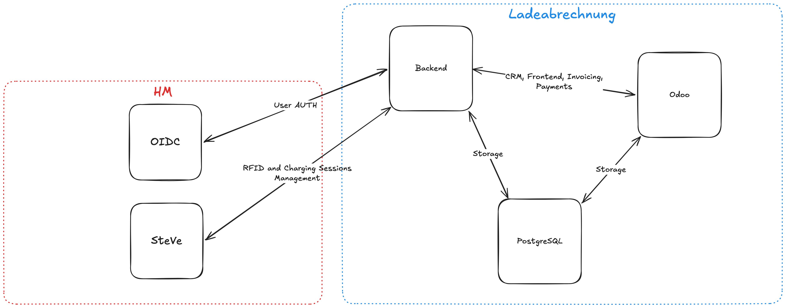
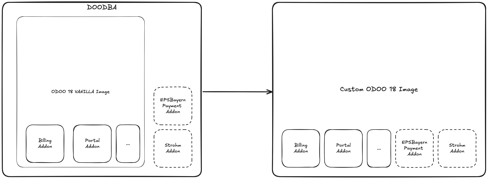

# Umsetzung

## Interfaces

The system has 3 internal and 2 external components:

1. [Backend](https://github.com/MINcomSmartSolutions/strohm/tree/main/backend)
2. Odoo
3. PostgreSQL
4. HM IdP
5. HM SteVe

and roughly looks like this



Ladeabrechnung site only responsible for Backend, Odoo, and PostgreSQL but needs 4 and 5 for to function properly.

Backend uses node.js 22-24, Express server. It does the heavy lifting and communicates with all the other components.

Auth: The user authentication is done by OIDC that has RFID in the scope.

Responsible for session retrieval, user management to SteVe and works with pull based requests from Steve.

Uses Odooʼs portal module for frontend. Most confusing part would be the this part:

- Odoo is a big system and has a lot of moving parts. It works on a module based system
  written in python. It has a lot of functionality and uses that come from vanilla but we needed
  to built customization on top of them. First addon
  is [strohm_addon](https://github.com/MINcomSmartSolutions/strohm_addon) and other
  is [payment_epsbayern](https://github.com/MINcomSmartSolutions/payment_epsbayern)
- strohm_addon handles our custom needs and customizations throughout the odoo system and the epsbayern is a full
  fletched
  payment integration for the odoo, tough it needs the HM gateway which
  makes it to very limited use cases.
- To work with odoo, it requieres a lot of merges, patches, customizations to handle but we use something called to make
  this process easier. We point to the addons, vanilla odoo version and give it a config and it outputs a
  nice [image](https://github.com/MINcomSmartSolutions/doodba/pkgs/container/odoo) that we can run for us.



- The barebones of this structure is at
  [MINcomSmartSolutions/doodba](https://github.com/MINcomSmartSolutions/doodba) and
  setup_devel.yaml compose file fills them with proper files (docker compose -f ./setup_devel.yaml), but the working
  tree should be clean for it to work otherwise it throws an error and exits.
- We do not run the doodbaʼs
  production compose that includes cdn whitelisting smtp server etc which is in our opinion overengineered and it is for
  more complex odoo installs.

```
├── doodba
│   └── odoo
│       ├── auto
│       │   ├── addons
│       │   └── test-artifacts
│       └── custom
│           ├── build.d
│           ├── conf.d
│           ├── dependencies
│           ├── src
│           │   ├── private
│           │   │   ├── payment_epsbayern
│           │   │   └── strohm_addon
│           └── ssh
```

and the whole system when developing looks like as monolith after cloning strohm repo

```
├── backend
├── backups
├── devel-docker-compose.yml
├── docker-compose.yml -> devel-docker-compose.yml
├── docs
├── doodba // doodba repo
├── LICENSE
├── nginx.host.conf
├── ocpp-wallbox-sim // ocppwalbox sim repo
├── prod-docker-compose.yml
├── production_action.sh
├── README.md
├── setup-nginx.sh
├── steve //local steve
└── user-test-clean-docker-compose.yml
```

whoever wants to develop can do where .env.dev can be the environment file. The list of environment variables requiered
is at [strohm/README.md](https://github.com/MINcomSmartSolutions/strohm/blob/main/README.md)

```shell
docker compose -f devel-docker-compose.yml --env-file .env.dev up -d --build
```

and the whole backend doc is
at [strohm/docs/docs.md](https://github.com/MINcomSmartSolutions/strohm/blob/main/docs/docs.md)

Notes:

- SCIM is implemented and could have not been tested, since HM IT did not supported it.
- If the compose command fails for package read error. You need to get a read:packages token
  from github and login with docker login or you need to build your own images.
- The images are build with github actions.
- STROHM_DB_USER, STROHM_DB_PASSWORD; Odoo's PGUSER, PGPASSWORD needs to be created manually.

#### Backup/Restore

The scripts at automation is tailored for a speficic remote restic system, but for minimal changes to the scripts,
restic remote can be changed. Its restic adress to be used by SFTP are configured in the productions ssh auth system
file with alias and key.

System takes a full backup including odoo file store and db, backend db (not SteVe) every night. 