1. Für einen neuen Benutzer wird der Benutzer erst erstellt, nachdem die Einwilligung akzeptiert/gegeben wurde.
2. Sie werden möglicherweise feststellen, dass einige Funktionen wie `validateOIDCProperties` oder `db.getUserUnique`
   mehrfach verwendet werden, obwohl der vorherige Ablauf sie bereits überprüft oder verwendet hat. Der Grund dafür ist,
   dass kritische Funktionen auch die Gültigkeit ihrer Eingaben überprüfen, bevor sie verarbeitet werden, um nicht
   abgefangene Ausnahmen zu verhindern.
3. Throws werden in der Hauptcontroller-Funktion abgefangen und dem Benutzer/Anforderer als Flash-Nachrichten oder JSON
   mit Fehlerdetails zurückgegeben.

Die Funktionsdokumentation finden Sie [hier](../docs/docs.md)

```mermaid
flowchart TD
    Start([User visits /welcome]) --> LoginButton[User Clicks 'Anmelden mit HM' button]
    LoginButton --> AuthMiddleware
    AuthMiddleware{auth middleware<br/>express-openid-connect}
    AuthMiddleware -->|Not Authenticated| RedirectLogin[Redirect to /login<br/>OIDC Provider]
    RedirectLogin --> OIDCAuth[User authenticates<br/>at Auth0/OIDC]
    OIDCAuth --> CallbackRoute[OIDC Callback<br/>/callback route]
    CallbackRoute --> SetOIDCSession[Set OIDC session<br/>req.oidc.user]
    SetOIDCSession --> ConsentMiddleware[requireConsent middleware<br/>middlewares/consent.js]
    AuthMiddleware -->|Authenticated| ConsentMiddleware
    ConsentMiddleware --> CheckSkipRoutes{Check if route<br/>does requiere consent check?}
    CheckSkipRoutes -->|No: /consent, /logout,<br/>/health, /welcome, etc .| NextToRoute
    subgraph Middleware Routine
        CheckSkipRoutes -->|Yes| GetActiveConsent[getActiveConsentRevision<br/>services/consent.js]
        GetActiveConsent --> HasActiveConsent{Active consent<br/>revision exists?}
        HasActiveConsent -->|No| CreateTestConsent[createConsentRevision<br/>services/consent.js]
        CreateTestConsent --> ValidateOIDC
        HasActiveConsent -->|Yes| ValidateOIDC[validateOIDCProperties<br/>helpers/auth.js]
        ValidateOIDC -->|Invalid| LogoutRedirect[Redirect to /logout<br/>reason=invalid_session]
        ValidateOIDC -->|Valid| GetUserByOAuth[db.getUserUnique<br/>oauth_id: oidc.user.sub]
        GetUserByOAuth --> UserExists{User exists<br/>in DB?}
        UserExists -->|Yes| UpdateSession{Session needs<br/>update?}
        UpdateSession -->|Yes| SaveSessionSecure[Update session<br/>req.session.user]
        UpdateSession -->|No| CheckConsent
        SaveSessionSecure --> CheckConsent
    end
    UserExists -->|No - New User| RedirectConsent[Redirect to /consent]
    CheckConsent{Has latest<br/>consent?}
    CheckConsent -->|Yes| NextToRoute[next - Continue<br/>to route handler]
    CheckConsent -->|No| RedirectConsent
    RedirectConsent --> GetConsentPage[GET /consent<br/>controllers/consent.js]
    GetConsentPage --> ValidateOIDC2[validateOIDCProperties<br/>helpers/auth.js]
    ValidateOIDC2 -->|Invalid| ThrowAuthError[Throw AuthError<br/>reason=invalid_session]
    ValidateOIDC2 -->|Valid| GetUserAgain[db.getUserUnique<br/>oauth_id: oidc.user.sub]
    GetUserAgain --> CheckHasConsent2{User exists &<br/>has consent?}
    CheckHasConsent2 -->|Yes| RedirectHome1[Redirect to /]

CheckHasConsent2 -->|No|GetActiveConsent2[getActiveConsentRevision<br/>services/consent.js]
GetActiveConsent2 --> RenderConsentPage[Render consent.html<br/>with dynamic content]

RenderConsentPage --> UserSeesConsent[User sees consent form]
UserSeesConsent --> UserSubmits{User submits<br/>consent form}

UserSubmits -->|Declined|LogoutDeclined[Redirect to<br/>/logout?reason=consent_declined]

UserSubmits -->|Accepted| PostConsent[POST /consent<br/>controllers/consent.js]
PostConsent --> ValidateOIDC3[validateOIDCProperties<br/>helpers/auth.js]
ValidateOIDC3 -->|Invalid|ThrowAuthError2[Throw AuthError<br/>reason=invalid_session]

ValidateOIDC3 -->|Valid| UserOps2[userOperations<br/>services/user_operations.js<br/>Only called here after consent]

UserOps2 --> CheckUserExists2{User exists?}
CheckUserExists2 -->|No|CreateUser[db.createUser<br/>utils/queries.js]
CreateUser --> CheckExternal[checkANDcreateUserInExternalSystems<br/>services/user_operations.js]

CheckUserExists2 -->|Yes|CheckExternal

CheckExternal --> CheckOdoo{Has odoo_user_id?}
CheckOdoo -->|No|CreateOdooUser[createOdooUser<br/>services/odoo.js]
CreateOdooUser --> SetOdooCreds[db.setUserOdooCredentials<br/>utils/queries.js]
SetOdooCreds --> CheckSteve

CheckOdoo -->|Yes|CheckSteve{Has steve_id?}
CheckSteve -->|No| CreateSteveUser[createSteveUser<br/>services/steve_user.js]
CreateSteveUser --> ValidateUserSchema

CheckSteve -->|Yes|ValidateUserSchema[validateUser<br/>utils/joi.js]
ValidateUserSchema --> ReturnUser[Return fully<br/>qualified user]

ReturnUser --> CheckHasConsent3[hasLatestConsent<br/>services/consent.js]
CheckHasConsent3 -->|Yes|RedirectHome2[Redirect to /]

CheckHasConsent3 -->|No|GetActiveConsent3[getActiveConsentRevision<br/>services/consent.js]
GetActiveConsent3 --> RecordConsent[recordConsent<br/>services/consent.js]
RecordConsent --> SaveUserSession[update session]
SaveUserSession --> RedirectHome3[Redirect to /]

NextToRoute --> RootHandler[GET / handler<br/>app.js]
RedirectHome1 --> RootHandler
RedirectHome2 --> RootHandler
RedirectHome3 --> RootHandler

RootHandler --> IsAuthenticated{req.oidc<br/>.isAuthenticated?}
IsAuthenticated -->|No|RedirectWelcome[Redirect to /welcome]

IsAuthenticated -->|Yes| HasSessionUser{req.session<br/>.user exists?}
HasSessionUser -->|No|RedirectWelcome

HasSessionUser -->|Yes|ValidateSessionUser[Validate session user with OIDC user<br/>db.getUserUnique]
ValidateSessionUser --> UserStillExists{User is valid, exists<br/>& active?}

UserStillExists -->|No or Deactivated|LogoutInvalid[Redirect to /logout<br/>reason=invalid_session<br/>or account_deactivated]

UserStillExists -->|Yes|GetPortalLogin[getOdooPortalLogin<br/>services/odoo.js]
GetPortalLogin --> GetOdooCreds[db.getUserOdooCredentials<br/>utils/queries.js]
GetOdooCreds --> BuildPortalURL[Build Odoo portal URL<br/>with credentials & hash]
BuildPortalURL --> RedirectOdoo[Redirect to<br/>Odoo Portal]

RedirectOdoo --> End([User arrives at<br/>Odoo Portal])

style Start fill: #90EE90
style End fill: #FFB6C6
style AuthMiddleware fill: #87CEEB
style ConsentMiddleware fill:#87CEEB
style UserOps2 fill: #DDA0DD
style GetConsentPage fill: #FFD700
style PostConsent fill: #FFD700
style RootHandler fill: #FFD700
style CreateOdooUser fill:#F0E68C
style CreateSteveUser fill: #F0E68C
style LogoutRedirect fill: #FF6B6B
style LogoutInvalid fill: #FF6B6B
style LogoutDeclined fill: #FF6B6B
```

