**UPDATED:** October 2025 - Refactored to use separate `ensureAuthenticated` and `requireConsent` middlewares.

## Wichtige Hinweise

1. Für einen neuen Benutzer wird der Benutzer erst erstellt, nachdem die Einwilligung akzeptiert/gegeben wurde.
2. Die Architektur folgt jetzt dem **Single Responsibility Principle**:
    - `ensureAuthenticated` middleware: Validiert OIDC und lädt Benutzer → setzt `req.user`
    - `requireConsent` middleware: Prüft nur die Einwilligung
    - `req.user` ist die einzige Wahrheitsquelle während der Anfrage
    - `req.session.user` ist nur für die Persistenz über Anfragen hinweg
3. Middlewares werden direkt auf Routen angewendet, nicht global
4. Throws werden in der Hauptcontroller-Funktion abgefangen und dem Benutzer/Anforderer als Flash-Nachrichten oder JSON
   mit Fehlerdetails zurückgegeben.

**Weitere Dokumentation:**

- [Authentication Refactoring Summary](../backend/AUTHENTICATION_REFACTORING_SUMMARY.md)

## User Login and Registration Flow

```mermaid
flowchart TD
    Start([User clicks<br/>Login Button]) --> OIDCMiddleware{OIDC middleware<br/>express-openid-connect}
    OIDCMiddleware -->|Not Authenticated| RedirectLogin[Redirect to /login<br/>OIDC Provider]
    RedirectLogin --> CallbackRoute[OIDC Callback<br/>/callback]
    CallbackRoute --> SetOIDCSession[Set OIDC session<br/>req.oidc.user<br/>req.oidc.isAuthenticated = true]
    SetOIDCSession --> RouteRequest[Request to protected route<br/>e.g., GET /]
OIDCMiddleware -->|Authenticated|RouteRequest

RouteRequest --> EnsureAuthMiddleware

subgraph "ensureAuthenticated Middleware (middlewares/ensureAuthenticated.js)"
EnsureAuthMiddleware[ensureAuthenticated<br/>middleware runs]
EnsureAuthMiddleware --> ValidateOIDC[validateOIDCProperties<br/>helpers/auth.js]
ValidateOIDC -->|Invalid|RedirectWelcome1[Redirect to /welcome<br/>Clear session]
ValidateOIDC -->|Valid| GetUserByOAuth[db.getUserByOAuthID<br/>oauth_id: oidc.user.sub]
GetUserByOAuth --> UserExists{User exists<br/>in DB?}
UserExists -->|Yes| SetReqUser[Set req.user = user<br/>SINGLE SOURCE OF TRUTH]
SetReqUser --> SyncSession{Session needs<br/>sync?}
SyncSession -->|Yes|UpdateSession[Update req.session.user<br/>session.save]
SyncSession -->|No|AuthNext[next - Continue]
UpdateSession --> AuthNext
UserExists -->|No - New User|ClearSession[Clear stale session<br/>req.session.user = undefined]
ClearSession --> AuthNext
end

AuthNext --> ConsentMiddleware

subgraph "requireConsent Middleware (middlewares/requireConsent.js)"
ConsentMiddleware[requireConsent<br/>middleware runs]
ConsentMiddleware --> CheckReqUser{req.user<br/>exists?}
CheckReqUser -->|No - New User|RedirectConsent[Redirect to<br/>/consent]
CheckReqUser -->|Yes|HasActiveConsent{hasLatestConsent<br/>services/consent.js}
HasActiveConsent -->|Yes|ConsentNext[next - Continue]
HasActiveConsent -->|No|RedirectConsent
end

RedirectConsent --> GetConsentRoute

subgraph "GET /consent Route (controllers/consent.js)"
GetConsentRoute[GET /consent<br/>ensureAuthenticated middleware runs]
GetConsentRoute --> ConsentCheckUser{req.user<br/>exists?}
ConsentCheckUser -->|Yes|CheckHasConsent2[hasLatestConsent<br/>services/consent.js]
CheckHasConsent2 -->|Yes|RedirectHome1[Redirect to /]
CheckHasConsent2 -->|No| GetActiveConsent2[getActiveConsentRevision<br/>services/consent.js]
ConsentCheckUser -->|No| GetActiveConsent2
GetActiveConsent2 --> RenderConsentPage[Render consent.html<br/>with dynamic content]
end

RenderConsentPage --> UserSeesConsent[User sees consent form]
UserSeesConsent --> UserSubmits{User submits<br/>consent form}
UserSubmits -->|Declined|LogoutDeclined[Redirect to<br/>/logout?reason=consent_declined]
UserSubmits -->|Accepted| PostConsentRoute

subgraph "POST /consent Route (controllers/consent.js)"
PostConsentRoute[POST /consent<br/>ensureAuthenticated middleware runs]
PostConsentRoute --> UserOps2[userOperations<br/>services/user_operations.js<br/>Creates user + external accounts]
UserOps2 --> CheckUserExists2{User exists?}
CheckUserExists2 -->|No| CreateUser[db.createUser<br/>utils/queries.js]
CreateUser --> CheckExternal[checkANDcreateUserInExternalSystems<br/>services/user_operations.js]
CheckUserExists2 -->|Yes|CheckExternal
CheckExternal --> CreateConsentRecord[createUserConsentRevision<br/>services/consent.js]
CreateConsentRecord --> UpdateReqUser[Update req.user<br/>and req.session.user]
UpdateReqUser --> RedirectHome2[Redirect to /]
end

ConsentNext --> RootHandler
RedirectHome1 --> RootHandler
RedirectHome2 --> RootHandler

subgraph "GET / Route Handler (app.js)"
RootHandler[GET / handler<br/>ensureAuthenticated + requireConsent]
RootHandler --> CheckReqUser2{req.user<br/>exists?}
CheckReqUser2 -->|No|ThrowUserNotFound[Throw AuthError<br/>USER_NOT_FOUND<br/>Should not happen!]
CheckReqUser2 -->|Yes|CheckDeactivated{req.user<br/>deactivated?}
CheckDeactivated -->|Yes|LogoutInvalid[Redirect to /logout<br/>reason=account_deactivated]
CheckDeactivated -->|No| GetPortalLogin[getOdooPortalLogin<br/>services/odoo.js<br/>Pass req.user]
GetPortalLogin --> GetOdooCreds[db.getUserOdooCredentials<br/>utils/queries.js]
GetOdooCreds --> BuildPortalURL[Build Odoo portal URL<br/>with credentials & hash]
BuildPortalURL --> RedirectOdoo[Redirect to<br/>Odoo Portal]
end

RedirectOdoo --> End([User arrives at<br/>Odoo Portal])

style Start fill: #90EE90
style End fill: #FFB6C6
style OIDCMiddleware fill: #87CEEB
style EnsureAuthMiddleware fill: #87CEEB
style ConsentMiddleware fill: #87CEEB
style GetConsentRoute fill: #FFD700
style PostConsentRoute fill: #FFD700
style RootHandler fill: #FFD700
style UserOps2 fill: #DDA0DD
style RedirectWelcome1 fill: #FF6B6B
style ThrowUserNotFound fill: #FF6B6B
style LogoutInvalid fill: #FF6B6B
style LogoutDeclined fill: #FF6B6B
```



```

