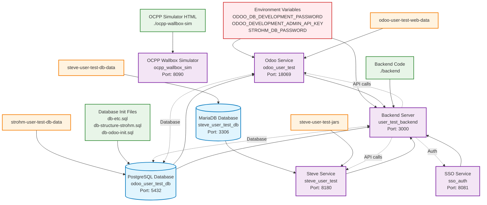

# User Test Environment Dependencies

This diagram shows the service dependencies and shared environment configuration for the user-test-docker-compose.yml
setup.

Databases in blue, services in purple, volumes (files) in orange.

## Service Port Mapping

| Service        | Internal Port | External Port | Description                    |
|----------------|---------------|---------------|--------------------------------|
| SSO            | 8080          | 8081          | OAuth2 Mock Server             |
| PostgreSQL     | 5432          | 5432          | Odoo & Backend Database        |
| MariaDB        | 3306          | 3306          | Steve Database                 |
| Odoo           | 8069          | 18069         | Odoo ERP System                |
| Steve          | 8180          | 8180          | EV Charging Station Management |
| Backend        | 3000          | 3000          | Node.js API Server             |
| OCPP Simulator | 80            | 8090          | Wallbox Simulator              |

## Environment Variables

- **ODOO_DB_DEVELOPMENT_PASSWORD**: Database password for Odoo
- **ODOO_DEVELOPMENT_ADMIN_API_KEY**: Admin API key for Odoo
- **STROHM_DB_PASSWORD**: Database password for Strohm backend

## Key Dependencies

1. **Backend Service** depends on:
    - PostgreSQL database (with health check)
    - Odoo service
    - Steve service
    - SSO service for authentication

2. **Odoo Service** depends on:
    - PostgreSQL database (with health check)

3. **Steve Service** depends on:
    - MariaDB database

4. **All services** share the same Docker network for internal communication
